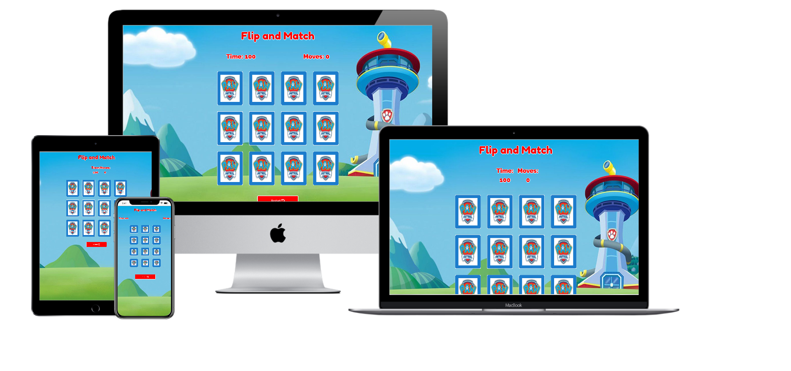

## Interactive Frontend Development Milestone Project

## About the Website

Flip and Match is a memory game for toddlers. This picture matching game will challenge your memory, concentration, attention and test your brain skills. Flip and Match is a great way to exercise memory and test toddlers brain. Find the matching tiles with Paw Patrol theme!
This game will not only improve toodlers memory, it also increase accuracy, train reflexes, increase speed and can help you with short term memory problems or lack of attention like ADHD. Which also toddlers will enjoy playing with their favorite characters of pawpatrol.

## UX

This game is design to be user friendly for the toodlers between the age of 1 to 3 years old. Which the toddlers will be challenge to finish the game inside the time limit of 60 seconds. Flip and Match has 12 tiles of cards that the user need to pair 2 match cards.

## User Stories

* As a parent of the user, I would like to have a is easy to use game website without complication for my toddler.
* As a parent of the user, I would like to my toddler to play a exciting game that will challenge him and will  have fun.
* As a parent of the user, I would like my toodler to play a game that will excercise his memory and to enhance it as well.
* As a parent of the user, I would like my toddler to play a game that will benefit him.

## Wireframes Mockups

## Features and Structure of the Site

This website is a one page website that has the title of the game at the top center part with the details game at thye buttom of it which is the "Time" and "Move". The time will start to count from 1 second up to 60 second, while the move will work to show how many moves the player have done. At the center part you will see a 12 card tile that is facing back, each every card has an image. In the buttom part where the "Play/Pause/Resume" button located.

When the player finish the game the Game over container will show, which will tell the player how many second they completed the game and how many moves the player did. At the buttom part of the game the player can see the "Play again" option.

## Implemented Features

* Time - Shows the timer
* Moves - Shows the flips of the card
* Responsive card tiles
* Clickable Play button

## Features left to Implement

In the future I would like to implement more features :

* Put Audio sound for the background, flipping, matched, game over and victory
* Put some animation when the cards are matched
* Add some options of levels which in every level has different challenges

## Technologies Used

## Testing

### Responsiveness

### Browerser Compatibility

## Deployment

## How to run this project locally

## Credits

### Contents

### Media

## Acknowledgement

## Disclaimer
