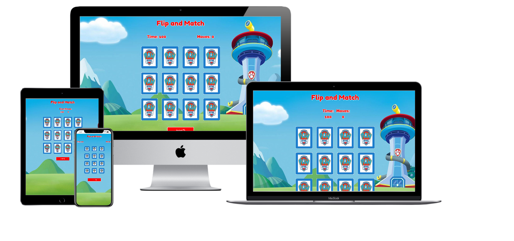

## Interactive Frontend Development Milestone Project

Live site click [Here](https://saharalnoor.github.io/flip-and-match-MS2/)

## About the Website

Flip and Match is a memory game for toddlers. This picture matching game will challenge your memory, concentration, attention and test your brain skills. Flip and Match is a great way to exercise memory and test toddlers brain. Find the matching tiles with Paw Patrol theme!
This game will not only improve toodlers memory, it also increase accuracy, train reflexes, increase speed and can help you with short term memory problems or lack of attention like ADHD. Which also toddlers will enjoy playing with their favorite characters of pawpatrol.

## UX

This game is design to be user friendly for the toodlers between the age of 1 to 3 years old. Which the toddlers will be challenge to finish the game inside the time limit of 60 seconds. Flip and Match has 12 tiles of cards that the user need to pair 2 match cards.

## User Stories

* As a parent of the user, I would like to have a is easy to use game website without complication for my toddler.
* As a parent of the user, I would like to my toddler to play a exciting game that will challenge him and will  have fun.
* As a parent of the user, I would like my toodler to play a game that will excercise his memory and to enhance it as well.
* As a parent of the user, I would like my toddler to play a game that will benefit him.

## How to play
- Clicking the play button the game will start and the timer will start also. Flip to pair of cards until you will match 6 pairs of cards. The player should be finish matching the card in the lenght of 60 seconds.

## Wireframes Mockups
* [Wireframe-Mobile](readMeDocs/WireFrames/wireframes-phone.pdf)
* [Wireframe-Desktop](readMeDocs/mockups/wireframe-computer.pdf)

## Features and Structure of the Site

This website is a one page website that has the title of the game at the top center part with the details game at thye buttom of it which is the "Time" and "Move". The time will start to count from 1 second up to 60 second, while the move will work to show how many moves the player have done. At the center part you will see a 12 card tile that is facing back, each every card has an image. In the buttom part where the "Play/Pause/Resume" button located.

When the player finish the game the Game over container will show, which will tell the player how many second they completed the game and how many moves the player did. At the buttom part of the game the player can see the "Play again" option.

## Implemented Features

* Time - Shows the timer
* Moves - Shows the flips of the card
* Responsive card tiles
* Clickable Play button

## Features left to Implement

In the future I would like to implement more features :

* Put some animation when the cards are matched
* Add some options of levels which in every level has different challenges
* Putting stars to rate how good the player is

## Technologies Used
- HTML : To form the structure of the site.
- CSS : To style the site.
- Gitpod : IDE used to build the website.
- [Github] :  A remote repository used to store the source code for the project.
- [Balsamiq](https://balsamiq.com/): Wireframe builder application.
- [Bootstrap](https://getbootstrap.com/) : A framework to help you design websites faster and easier
- [Google Fonts](https://fonts.google.com/) : For font style.

## Testing

This website has gone through validation using the following resources

The validity and formatiing of codes was checked by:

- HTML Validation
    - [Index page](readMeDocs/testing-resources/Html-Validation.pdf)

- CSS Validation
    - [Style-css](readMeDocs/testing-resources/CSS-Validation.pdf)

- JS Hint
    - [Main-Js](readMeDocs/testing-resources/JS-Hint.pdf)

### Responsiveness

The responsiveness of the website has been tested across a range of devices (Galaxy S5, Iphone 5/6/7/8/X, IPad, IPad Pro and Desktop PC) using **Google Chrome Developer Tools**

It is been tested on:

Personal phones
- Huawei P30 - Works as intended.
- Huawei P30 pro - Works as intended.
- IPhones - experiencing some issues regarding on flipping.

Desktops/ Laptops
- Lenovo IdeaPad S145 1920 x 1080 (Windows Computer) - Works as intended.
- MacOS computer 2880 x 1800 (Mac Computer) - experiencing some issues regarding on flipping.

### Browerser Compatibility
- Firefox: Works as intended.
- Chrome: Works as intended.
- Edge: Works as intended.
- Safari: experiencing some issues regarding on flipping.

## Deployment

This site was build using Gitpod IDE, under version control committing to git and pushed to GitHub.

In order to deploy this page to GitHub from Github repository, here are the following steps to do:

1. From the list of repositories, select **https://saharalnoor.github.io/flip-and-match-MS2/**
2. From the menu click on the **Settings** tab.
3. Scroll down to **GitHub Pages** section.
4. Under **Source** select **Master Branch**.
5. On selecting Master Branch the page will automatically refreshed, the website is now deployed.
6. Scroll back down to the **GitHub Pages** section to retrieve the link to the deployed website.

## How to run this project locally

To clone this project from GitHub:

1. Follow this link to the [Project GitHub repository.](https://saharalnoor.github.io/flip-and-match-MS2/)
2. Under the repository name, click **"Clone or download"**
3. In the **Clone with HTTPs** section, click the **Copy Button** for the repository
4. In your local IDE open a terminal
5. Change the current working directory to the location where you want the cloned directory to be made
6. **Type git clone**, and then **Paste the URL** you copied in Step 3
7. Press **Enter**. Your local clone will be created

## Credits
- Some of the codes was taken from, stockoverfloe, w3, and some tutorial in youtube
    - How to Code a Card Matching Game by Web Dev Simplified
    - Memory Game - Vanilla JavaScript by freeCodeCamp.org

### Media
- The images used for the memory cards and background were taken from Google Images and are used for educational purposes only.
- The Audio file are from Zapslat.com

## Acknowledgement
I would like to thank these persons for helping to make this project.

- My mentor Brian Macharia for guiding me through out the process of this project.

- My son who is my inspiration to make this game 

## Disclaimer
The content of this website, including the images used, are for educational purposes only.